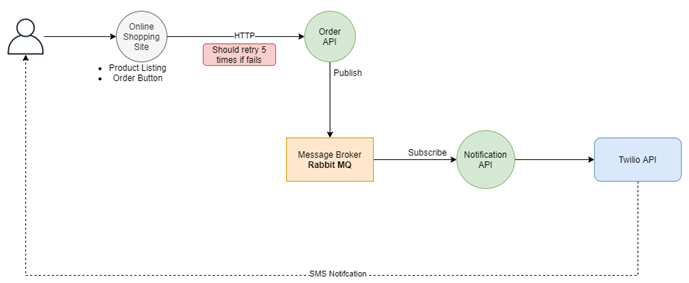

<h2 align="center">Cloud Apprentice Program</h2>

This project is a part of cloud apprentice program that uses various cloud technologies to build a mini demo project.

### Things done

- Deploying a productListing site with orderButton
- Sending user information to orderApi hosted on different port when clicking order button
- Retry Pattern: Retrying request (5 times) to orderApi incase of failure
- OrderApi sends a message to RabbitMQ(message broker)
- Notification application listens to message broker for incoming messages and send SMS to user using Twilio API
- Upload application image to DockerHub
- Deploying site using kubernetes, minikube used as local kubernetes

### Reports:

<a href="https://drive.google.com/file/d/1OALzDO6b2xuhxbHZwZRmCPltcLos0kcg/view?usp=sharing"> Week-4 Report <a>

<a href="https://drive.google.com/file/d/1LhujoNbU7akKrw0z4cOnoLY9LAG914WM/view?usp=sharing"> Week-3 Report <a>
